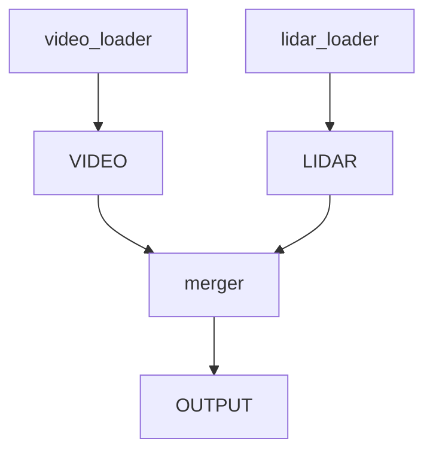

# easyflow

Launch a set of interconnected applications defined in one dataflow
configuration file. Included process reads this file and set up data
senders and receivers accordingly.

## The Dataflow File

This [dataflow.json5](examples/video_lidar_merge-rust/dataflow.json5)
file defines the flow for example.



## Python Example

The Python
[example](https://github.com/jerry73204/easyflow-python/tree/main/example)
is in the
[easyflow-python](https://github.com/jerry73204/easyflow-python/)
repositroy.

In this example, the `lidar_loader` process generates point cloud
messages and publish them via a sender. The sender is created from the
dataflow. The `video_loader` acts in similar way.

```python
import easyflow
flow = easyflow.load_dataflow("dataflow.json5")
sender = flow.build_sender("lidar_loader")
sender.send(b'bytes')
```

The `merger` process reads both lidar and video messages from both
loaders.

```python
def video_callback(payload):
    pass  # omit

def lidar_callback(payload):
    pass  # omit

video_listener = flow.listen_from("merger", "VIDEO", video_callback)
lidar_listener = flow.listen_from("merger", "LIDAR", lidar_callback)
```

## Rust Example

The Rust example is in the
[directory](examples/video_lidar_merge-rust/).

In this example, the `lidar_loader` process generates point cloud
messages and publish them via a sender. The sender is created from the
dataflow. The `video_loader` acts in similar way.

```rust
let dataflow = Dataflow::open("dataflow.json5")?;
let mut sender = dataflow.build_sender("lidar_loader").await?;
sender.send(bytes).await?;
```

The `merger` process reads both lidar and video messages from both
loaders.

```rust
let mut video_receiver = dataflow.build_receiver_from("merger", "VIDEO").await?;
let mut lidar_receiver = dataflow.build_receiver_from("merger", "LIDAR").await?;
let (video_packet, lidar_packet) = try_join!(video_receiver.recv(), lidar_receiver.recv())?;
```

## Using _easyflow_ in Your Project

### Python

Using pip,

```bash
pip install -U git+https://github.com/jerry73204/easyflow-python.git
```

### Rust

Add this line to your `Cargo.toml`.

```toml
easyflow = { version = "0.1.0", git = "https://github.com/jerry73204/easyflow.git" }
```
